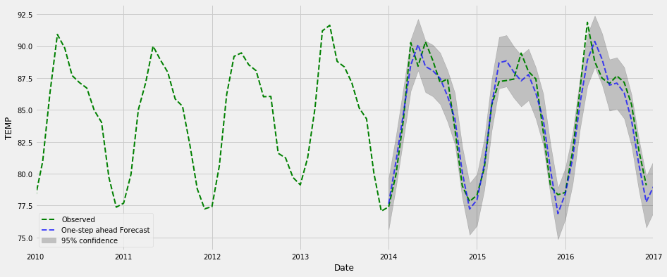

# Parallel Genetic Algorithms for Optimizing the SARIMA Model

This is an example of how we can use a genetic algorithm in an attempt to find the optimal SARIMA parameters for prediction tasks. 

On the National Climatic Data Center (NCDC) dataset, we are able to quickly find the best SARIMA model. 

To download the NCDC dataset:

- ftp://ftp.ncdc.noaa.gov/pub/data/gsod/


## The basic idea of this model is:


## To run

To run the Final code of the genetic algorithm:


```Final_code.ipynb```

1- To chnage the number of generations and populations:
```
generations  = [10, 20, 50, 100, 200]  # Number of times to evole the population.

populations  = [10, 50, 100, 200, 300, 400, 500]  # Number of SARIMA models in each generation.
```

2- You can set your SARIMA (p, d, q) × (P, D, Q)12 parameter choices by editing the following part of code:

```  
def main():
    """Evolve a network."""
    generations  = [10, 20]  # Number of times to evole the population.[10, 20, 50, 100, 200]
    populations  = [ 10, 50]  # Number of SARIMA models in each generation. [10, 50, 100, 200, 300, 400, 500]
    nn_param_choices = {
        'p_values' : range(0, 3),#range(0, 13)
        'd_values' : range(0, 2),#range(0, 2)
        'q_values' : range(0, 3),#range(0, 13)
        'sp_values': range(0, 3),#range(0, 13)
        'sd_values': range(0, 2),#range(0, 2)
        'sq_values': range(0, 3) #range(0, 13)
    }
```

3- To save the results of experiments we use score_table  data frame:

``` score_table.to_csv(file_name2, sep=',', encoding='utf-8', mode='a', header=True) ```


4- To plot parallel time for GA-SARIMA:
```
# Get the data.
filename='time2.csv'
```


5- To plot time series:


6- To plot One-step ahead Forecast, 95% confidence




# To select the best models based on P-VALUES

- score_table: contains all best models based ( AIC, MAPE, RMSE)

| Index | (p,d,q)   | (P,D,Q)       | AIC      | mape     | me         | mae      | mpe       | mse       | rmse     | corr     | minmax    |
|-------|-----------|---------------|----------|----------|------------|----------|-----------|-----------|----------|----------|-----------|
| 792   | (9, 0, 8) | (0, 0, 0, 12) | -164.876 | 0.444529 | -0.0295986 | 0.143071 | -0.21997  | 0.0281478 | 0.167773 | 0.957295 | 0.122894  |
| 540   | (6, 0, 7) | (0, 0, 0, 12) | -160.046 | 0.463257 | -0.034108  | 0.140457 | -0.216192 | 0.0268177 | 0.163761 | 0.959942 | 0.0968388 |
| 229   | (1, 0, 0) | (1, 0, 1, 12) | -159.497 | 0.466809 | -0.0494717 | 0.142398 | -0.206366 | 0.0281191 | 0.167688 | 0.959793 | 0.193557  |
| 828   | (9, 0, 9) | (0, 0, 0, 12) | -158.925 | 0.462261 | -0.0319526 | 0.145104 | -0.227347 | 0.0275848 | 0.166087 | 0.958335 | 0.122391  |

- score_table2 : contains all best models FROM score_table based ( P-VALUES < 0.05)

| Index | (p,d,q)   | (P,D,Q)       | AIC      | mape     | me         | mae       | mpe       | mse       | rmse     | corr     | minmax     |
|-------|-----------|---------------|----------|----------|------------|-----------|-----------|-----------|----------|----------|------------|
| 9     | (0, 0, 0) | (1, 0, 1, 12) | -148.177 | 0.458842 | -0.0495432 | 0.139759  | -0.200593 | 0.0272963 | 0.165216 | 0.961095 | 0.195071   |
| 34    | (0, 0, 1) | (2, 1, 0, 12) | -110.892 | 0.367977 | 0.0122085  | 0.0945813 | -0.182121 | 0.0142993 | 0.11958  | 0.978752 | -0.263296  |
| 90    | (1, 0, 0) | (2, 1, 0, 12) | -110.456 | 0.375643 | 0.0134213  | 0.096992  | -0.186618 | 0.0150715 | 0.122766 | 0.977709 | -0.465028  |
| 17    | (0, 0, 0) | (2, 1, 0, 12) | -107.233 | 0.348173 | 0.0101313  | 0.0890584 | -0.170927 | 0.0126278 | 0.112373 | 0.981129 | -0.0930694 |


# Describtion of files
- `allgenomes.py`: Class that keeps track of all genomes trained so far, and their scores.
    Among other things, ensures that genomes are unique.

- `idgen.py`: Provide unique genome IDs.

- `network.py`: Class that represents the model to be evolved. (UniID: Mom and Dad: Gen)

- `optimizer.py`: Class that holds a genetic algorithm for evolving a model.

- `parallel.py`: Provide the code to run parallel genetic version. the complete version in 


- `preprocessing.py`: To pre-process the original data 433440-99999-merge.op as shown in 

```
from preprocessing import preprocess
import os
from os.path import isfile, join
path = './'
train =[]
train.append(preprocess(join(path, '433440-99999-merge.op')))
df=pd.concat(train)
```
| Index | STN    | WBAN  | YEARMODA   | TEMP | DEWP | SLP    | STP    | VISIB | WDSP | MXSPD | GUST | MAX  | MIN  | PRCP |
|-------|--------|-------|------------|------|------|--------|--------|-------|------|-------|------|------|------|------|
| 0     | 433440 | 99999 | 2000-01-01 | 76.0 | 67.9 | 1011.8 | 1001.7 | 2.8   | 8.0  | 14.0  | NaN  | 85.1 | 68.5 | 0.01 |
| 1     | 433440 | 99999 | 2000-01-02 | 77.1 | 67.2 | 1011.8 | 1001.7 | 4.1   | 9.1  | 15.0  | NaN  | 86.0 | 68.0 | 0.00 |
| 2     | 433440 | 99999 | 2000-01-03 | 76.0 | 68.3 | 1011.3 | 1001.3 | 2.5   | 8.3  | 14.0  | NaN  | 81.3 | 71.6 | 0.00 |


# To run the brute force algorithm:


```python3_brute.py```

# How to use Google Colab to run the code

For more, see this blog post: 

- https://www.geeksforgeeks.org/how-to-use-google-colab/


[](https://github.com/ibrahim85/Genetic-Alg-and-SARIMA/blob/master/Genetic%20Alg%20and%20SARIMA/Final_code.ipynb)


A lot of those code was originally inspired by:

- http://lethain.com/genetic-algorithms-cool-name-damn-simple/
- Evolve a neural network with a genetic algorithm [this repository](https://github.com/harvitronix/neural-network-genetic-algorithm)
- https://medium.com/@harvitronix/lets-evolve-a-neural-network-with-a-genetic-algorithm-code-included-8809bece164

## License

MIT


