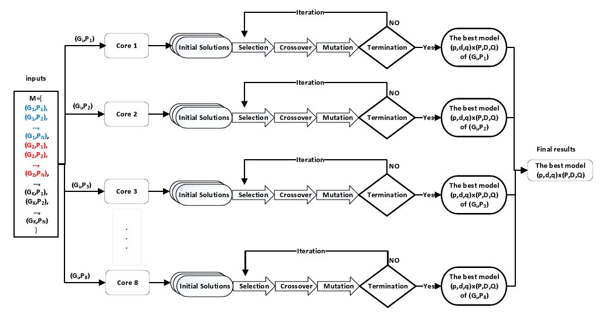
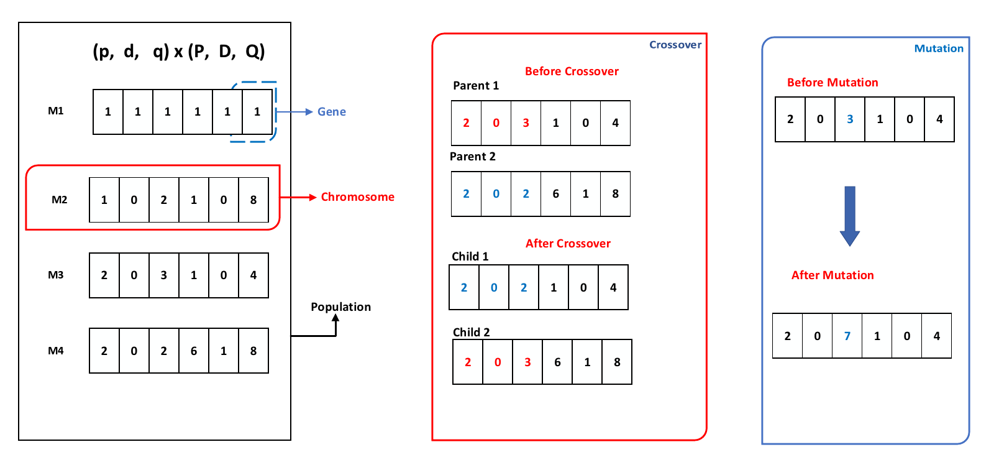
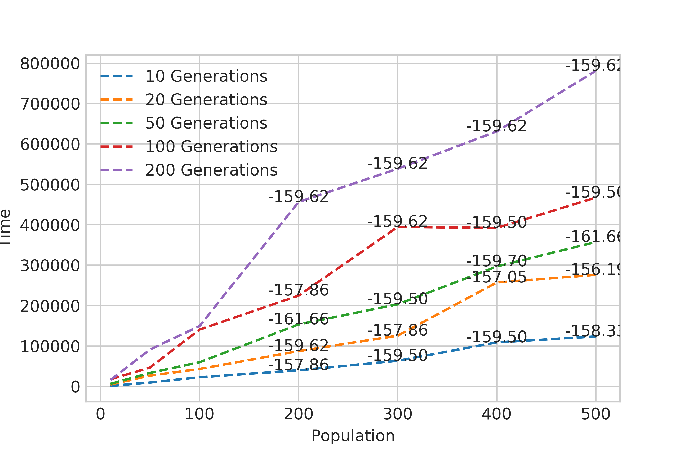
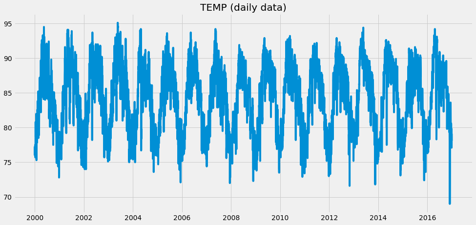
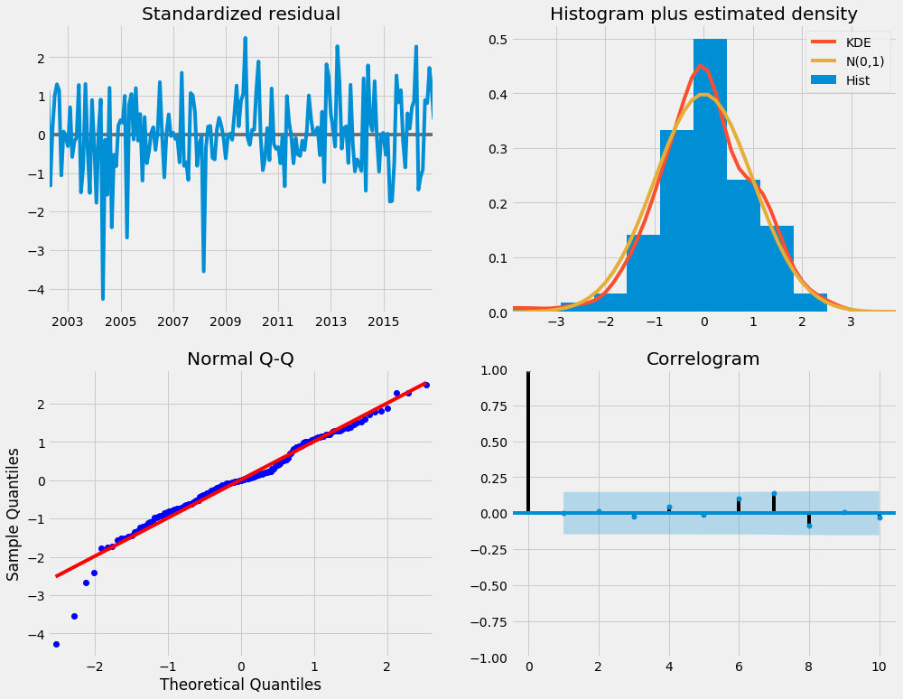

# Parallel Genetic Algorithms for Optimizing the SARIMA Model

This is an example of how we can use a genetic algorithm in an attempt to find the optimal SARIMA parameters for prediction tasks. 

On the NCDC dataset, we are able to quickly find the best SARIMA model. 

## the basic idea of this model is:






## To run

To run the Final code of the genetic algorithm:


```Final_code.ipynb```

To chnage the number of generations and populations:
```
generations  = [10, 20, 50, 100, 200]  # Number of times to evole the population.

populations  = [10, 50, 100, 200, 300, 400, 500]  # Number of SARIMA models in each generation.
```

To set the values of the SARIMA (p, d, q) × (P, D, Q)12: 

```  
def main():
    """Evolve a network."""
    generations  = [10, 20]  # Number of times to evole the population.[10, 20, 50, 100, 200]
    populations  = [ 10, 50]  # Number of SARIMA models in each generation. [10, 50, 100, 200, 300, 400, 500]
    nn_param_choices = {
        'p_values' : range(0, 3),#range(0, 13)
        'd_values' : range(0, 2),#range(0, 2)
        'q_values' : range(0, 3),#range(0, 13)
        'sp_values': range(0, 3),#range(0, 13)
        'sd_values': range(0, 2),#range(0, 2)
        'sq_values': range(0, 3) #range(0, 13)
    }
```

To save the results of experiments we use score_table  data frame:

``` score_table.to_csv(file_name2, sep=',', encoding='utf-8', mode='a', header=True) ```


To plot parallel time for GA-SARIMA:
```
# Get the data.
filename='time2.csv'
```


To plot time series:




To run the brute force algorithm:


```python3_brute.py```

To run the genetic algorithm:


```paper6--GA--SARIMAX_and_arima.ipynb```

 To plot the forecasting and other figures:
 
 use this file
 
  
  
 
 
 
```Serial_SARIMA_plots_model.ipynb```


# Describtion of files
- The config file can be runned like this: `config_dataset_opportunity_18_classes.py`.

- The config file can be runned like this: `config_dataset_opportunity_18_classes.py`.

# How to use Google Colab to run the code

https://www.geeksforgeeks.org/how-to-use-google-colab/

You can set your SARIMA parameter choices by editing each of those files first. You can also choose whether to use the NCDC or other datasets. 

[](https://github.com/ibrahim85/Genetic-Alg-and-SARIMA/blob/master/Genetic%20Alg%20and%20SARIMA/Serial%20SARIMA-%20plots%20model.ipynb)

For more, see this blog post: https://medium.com/@harvitronix/lets-evolve-a-neural-network-with-a-genetic-algorithm-code-included-8809bece164

For a more robust implementation that you can use in your projects, take a look at Jan Liphardt's implementation, DeepEvolve.

## License

MIT


